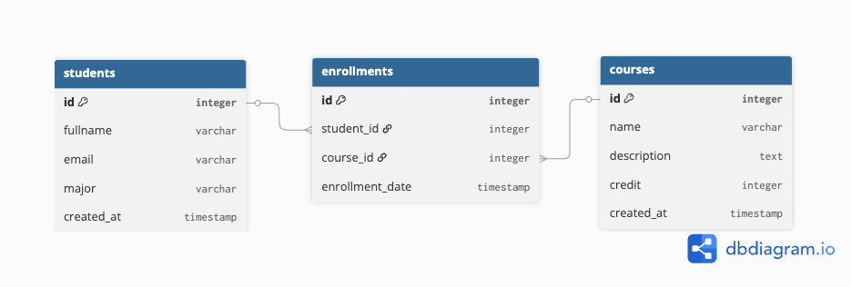
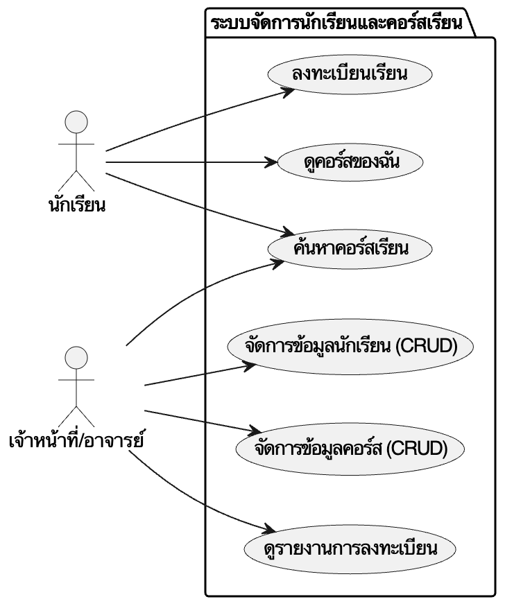

# ระบบจัดการนักเรียนและคอร์สเรียน (Student Course Management System)

RESTful API สำหรับจัดการข้อมูลนักเรียน คอร์สเรียน และการลงทะเบียน พัฒนาด้วย Node.js, Express และ Supabase

## สารบัญ
1.  [การติดตั้งและรันระบบ (Installation)](#1-การติดตั้งและรันระบบ-installation)
2.  [การออกแบบฐานข้อมูล (Database Design)](#2-การออกแบบฐานข้อมูล-database-design)
3.  [การออกแบบ API (API Design)](#3-การออกแบบ-api-api-design)
4.  [การทดสอบ (Testing)](#4-การทดสอบ-testing)
5.  [การจัดการเวอร์ชัน (Git Workflow)](#5-การจัดการเวอร์ชัน-git-workflow)
6.  [การ Deploy (Deployment)](#6-การ-deploy-deployment)

---

## 1. การติดตั้งและรันระบบ (Installation)

### สิ่งที่ต้องมี (Prerequisites)
-   Node.js
-   บัญชี Supabase และ Project

### ขั้นตอนการติดตั้ง
1.  **Clone Repository**:
    ```bash
    git clone <repository_url>
    cd <repository_folder>
    ```

2.  **ติดตั้ง Dependencies**:
    ```bash
    npm install
    ```

3.  **ตั้งค่า Environment Variables**:
    -   สร้างไฟล์ `.env` ในโฟลเดอร์หลัก
    -   คัดลอกเนื้อหาจาก `.env.example` และใส่ค่า Supabase credentials ของคุณ:
        ```env
        PORT=3000
        SUPABASE_URL=your_supabase_url
        SUPABASE_KEY=your_supabase_anon_key
        ```

4.  **รัน Server**:
    ```bash
    npm start
    # หรือสำหรับโหมดพัฒนา (Development)
    npm run dev
    ```

---

## 2. การออกแบบฐานข้อมูล (Database Design)

ดูแผนภาพ ERD และ Use Case ได้ที่ไฟล์ `design.md`

### ตารางและความสัมพันธ์ (Schema)


1.  **students**: เก็บข้อมูลนักเรียน (`id`, `fullname`, `email`, `major`)
2.  **courses**: เก็บข้อมูลวิชาเรียน (`id`, `name`, `description`, `credit`)
3.  **enrollments**: ตารางเชื่อมระหว่างนักเรียนและวิชาเรียน (`student_id`, `course_id`)

### Use Case Diagram


### คำอธิบายเชิงเทคนิค
*   **Primary Key (PK)**: คือคีย์หลักที่ใช้ระบุแถวข้อมูลที่ไม่ซ้ำกันในตาราง เช่น `students.id` ซึ่งจะไม่มีนักเรียนคนไหนที่มี ID ซ้ำกัน
*   **Foreign Key (FK)**: คือคีย์นอกที่ใช้อ้างอิงไปยัง PK ของตารางอื่น เพื่อสร้างความสัมพันธ์ เช่น `enrollments.student_id` อ้างอิงไปยัง `students.id` เพื่อระบุว่าการลงทะเบียนนี้เป็นของนักเรียนคนไหน
*   **Normalization**: เราออกแบบให้เป็น **3NF (Third Normal Form)** เพื่อลดความซ้ำซ้อนของข้อมูล (Data Redundancy)
    *   แยกข้อมูลนักเรียนและคอร์สออกจากกัน ไม่เก็บชื่อวิชาซ้ำๆ ในตารางนักเรียน
    *   ใช้ตาราง `enrollments` เป็นตัวเชื่อม (Junction Table) สำหรับความสัมพันธ์แบบ Many-to-Many

---

## 3. การออกแบบ API (API Design)

### Router & RESTful API Principles
*   **Router**: เราใช้ `express.Router` เพื่อแยกการจัดการ Route ออกเป็นไฟล์ย่อยๆ ตามหมวดหมู่ (`studentRoutes.js`, `courseRoutes.js`) ทำให้โค้ดเป็นระเบียบและดูแลรักษาง่าย
*   **RESTful API**: ระบบปฏิบัติตามหลักการ REST:
    *   **Resources**: มองข้อมูลเป็นทรัพยากรที่เข้าถึงได้ผ่าน URL
    *   **HTTP Methods**: ใช้ Method มาตรฐานในการกระทำกับข้อมูล:
        *   `GET`: ดึงข้อมูล
        *   `POST`: สร้างข้อมูลใหม่
        *   `PUT`: แก้ไขข้อมูล
        *   `DELETE`: ลบข้อมูล
    *   **Stateless**: Server ไม่เก็บสถานะของ Client แต่ละ Request ต้องมีข้อมูลครบถ้วนในตัวมันเอง

### การเชื่อมต่อกับ Supabase
*   ใช้ Library `@supabase/supabase-js` ในการเชื่อมต่อ
*   ตั้งค่า Client ใน `src/config/supabaseClient.js` โดยอ่านค่าจาก Environment Variables เพื่อความปลอดภัย (ไม่ฝัง Key ในโค้ด)

---

## 4. การทดสอบ (Testing)

### Postman Collection
*   [ดาวน์โหลด Postman Collection](postman_collection.json) - รวม Test Case ทั้งหมดไว้แล้ว สามารถ Import เข้า Postman เพื่อทดสอบได้ทันที

### Test Cases (กรณีทดสอบ)
| ID | Test Scenario (กรณีทดสอบ) | Endpoint | Method | Request Body Example | Expected Result (ผลลัพธ์ที่คาดหวัง) |
| :--- | :--- | :--- | :--- | :--- | :--- |
| **TC01** | **สร้างข้อมูลนักเรียน** (Create Student) | `/api/students` | `POST` | `{"fullname": "Somchai JaiDee", "email": "somchai@test.com", "major": "CS"}` | `201 Created` - สร้างสำเร็จ คืนค่าข้อมูลนักเรียนพร้อม ID |
| **TC02** | **ดึงข้อมูลนักเรียนทั้งหมด** (Get All Students) | `/api/students` | `GET` | - | `200 OK` - คืนค่ารายการนักเรียนทั้งหมด |
| **TC03** | **ดึงข้อมูลนักเรียนตาม ID** (Get Student by ID) | `/api/students/:id` | `GET` | - | `200 OK` - คืนค่าข้อมูลนักเรียนตาม ID ที่ระบุ |
| **TC04** | **แก้ไขข้อมูลนักเรียน** (Update Student) | `/api/students/:id` | `PUT` | `{"fullname": "Somchai Edit", "major": "SE"}` | `200 OK` - แก้ไขสำเร็จ คืนค่าข้อมูลที่อัปเดตแล้ว |
| **TC05** | **ลบข้อมูลนักเรียน** (Delete Student) | `/api/students/:id` | `DELETE` | - | `200 OK` - ลบสำเร็จ คืนค่าข้อความยืนยัน |
| **TC06** | **สร้างคอร์สเรียน** (Create Course) | `/api/courses` | `POST` | `{"name": "Intro to AI", "description": "Basics of AI", "credit": 3}` | `201 Created` - สร้างสำเร็จ คืนค่าข้อมูลคอร์สพร้อม ID |
| **TC07** | **ดึงข้อมูลคอร์สทั้งหมด** (Get All Courses) | `/api/courses` | `GET` | - | `200 OK` - คืนค่ารายการคอร์สทั้งหมด |
| **TC08** | **ลงทะเบียนเรียน** (Enroll Student) | `/api/enrollments` | `POST` | `{"student_id": 1, "course_id": 1}` | `201 Created` - ลงทะเบียนสำเร็จ คืนค่าข้อมูลการลงทะเบียน |
| **TC09** | **ลงทะเบียนซ้ำ** (Enroll Duplicate) | `/api/enrollments` | `POST` | `{"student_id": 1, "course_id": 1}` | `400 Bad Request` - แจ้งเตือนว่านักเรียนลงวิชานี้ไปแล้ว |
| **TC10** | **ดึงรายวิชาของนักเรียน** (Get Student Courses) | `/api/enrollments/student/:id` | `GET` | - | `200 OK` - คืนค่ารายการวิชาที่นักเรียนคนนั้นลงทะเบียนไว้ |

### Expected Output & Error Handling
*   **Success (2xx)**:
    *   `200 OK`: ทำรายการสำเร็จ (เช่น ดึงข้อมูล, ลบข้อมูล)
    *   `201 Created`: สร้างข้อมูลใหม่สำเร็จ พร้อมคืนค่าข้อมูลที่สร้าง
*   **Client Error (4xx)**:
    *   `400 Bad Request`: ข้อมูลที่ส่งมาไม่ถูกต้อง (เช่น ลงทะเบียนซ้ำ)
    *   `404 Not Found`: ไม่พบข้อมูลที่ต้องการ (เช่น ระบุ ID ผิด)
*   **Server Error (5xx)**:
    *   `500 Internal Server Error`: เกิดข้อผิดพลาดที่ฝั่ง Server (เช่น เชื่อมต่อฐานข้อมูลไม่ได้)

---

## 5. การจัดการเวอร์ชัน (Git Workflow)

เราใช้ **Feature Branch Workflow**:
1.  **Main Branch (`main`)**: เก็บโค้ดเวอร์ชันที่เสถียรและพร้อมใช้งาน (Production-ready)
2.  **Feature Branches**: สร้าง Branch ใหม่สำหรับแต่ละฟีเจอร์ (เช่น `feature/add-student-api`) เพื่อพัฒนาและทดสอบแยกกัน
3.  **Pull Requests (PR)**: เมื่อพัฒนาเสร็จ จะทำการ Merge กลับเข้า `main` ผ่านการทำ PR เพื่อให้มีการตรวจสอบโค้ด (Code Review) ก่อน

---

## 6. การ Deploy (Deployment)

ระบบนี้รองรับการ Deploy บน **Render** (Web Service)

### ขั้นตอนการ Deploy
1.  เชื่อมต่อ GitHub Repository กับ Render
2.  เลือก "Web Service"
3.  ตั้งค่า Build Command: `npm install`
4.  ตั้งค่า Start Command: `node server.js`
5.  เพิ่ม Environment Variables (`SUPABASE_URL`, `SUPABASE_KEY`) ในหน้า Dashboard ของ Render

### ข้อดี/ข้อเสียของการ Deploy บน Cloud
*   **ข้อดี (Pros)**:
    *   **Scalability**: รองรับผู้ใช้งานจำนวนมากได้ง่าย ปรับขยายทรัพยากรได้
    *   **Reliability**: มีความเสถียรสูง มีระบบสำรองข้อมูลและจัดการ Server ให้
    *   **Accessibility**: เข้าถึงได้จากทุกที่ทั่วโลกผ่าน Internet
*   **ข้อเสีย (Cons)**:
    *   **Cost**: อาจมีค่าใช้จ่ายสูงขึ้นตามปริมาณการใช้งาน
    *   **Dependency**: ต้องพึ่งพาอินเทอร์เน็ตและผู้ให้บริการ Cloud (Vendor Lock-in)
